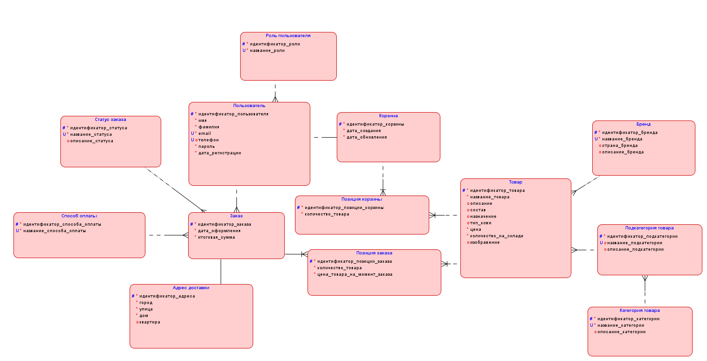
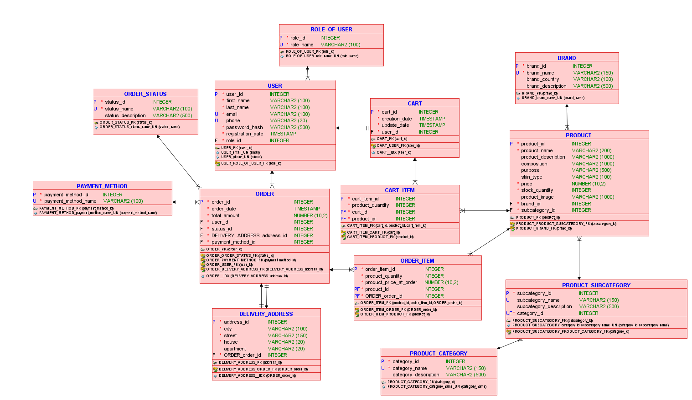

# База данных интернет-магазина парфюмерии и косметики

## Описание проекта

Проект представляет собой базу данных для интернет-магазина парфюмерии и косметики. База данных предназначена для хранения и обработки информации о товарах, брендах, категориях, подкатегориях, пользователях, корзинах, заказах, способах оплаты, адресах доставки и статусах заказов.

## Цель проекта

Цель проекта — разработать базу данных интернет-магазина парфюмерии и косметики, которая позволит:

- систематизировать сведения о товарах;
- хранить данные о пользователях интернет-магазина;
- контролировать остатки товаров на складе;
- оформлять заказы пользователей;
- учитывать состав заказов;
- управлять способами оплаты и статусами заказов;
- автоматизировать отдельные операции с помощью триггеров и хранимых процедур.

## Используемые технологии

- **Oracle SQL Developer Data Modeler** — для проектирования даталогической реляционной модели базы данных.
- **MySQL Workbench** — для создания базы данных, выполнения SQL-скриптов, заполнения таблиц, создания запросов, триггеров, процедур, пользователей и привилегий.
- **MySQL** — система управления базами данных.

## Структура базы данных

База данных называется: `beauty_shop`

В проекте используются следующие таблицы:

|Таблица|Назначение|
|---|---|
|`role_of_user`|Хранит роли пользователей системы|
|`users`|Хранит данные зарегистрированных пользователей|
|`cart`|Хранит корзины пользователей|
|`cart_item`|Хранит товары, добавленные в корзину|
|`order_status`|Хранит возможные статусы заказов|
|`payment_method`|Хранит способы оплаты|
|`delivery_address`|Хранит адреса доставки|
|`orders`|Хранит оформленные заказы|
|`order_item`|Хранит состав заказа|
|`brand`|Хранит информацию о брендах|
|`product_category`|Хранит основные категории товаров|
|`product_subcategory`|Хранит подкатегории товаров|
|`product`|Хранит товары интернет-магазина|
  
### Логическая модель базы данных:  
  
### Даталогическая модель базы данных:  
  

## Создание и наполнение базы данных
Скрипт создания: [create_db.sql](create_db.sql)  
Скрипт наполнения бд тестовыми данными: [inserts.sql](inserts.sql)  
## SQL-запросы
Скрипт: [selects.sql](selects.sql)  
В проекте реализованы запросы:
1. Запрос с соединением таблиц через `WHERE`.
2. Запрос с использованием `INNER JOIN`.
3. Запрос с использованием `CASE`.
4. Запрос с группировкой, агрегатными функциями и `HAVING`.
5. Запрос с использованием `LEFT JOIN`.
6. Запрос с вложенным подзапросом.
7. Запрос на создание представления `VIEW`.
## Триггеры
Скрипт: [triggers.sql](triggers.sql)  
В базе данных реализованы два триггера.

### 1. Уменьшение остатка товара на складе

Триггер `decrease_stock` срабатывает после добавления записи в таблицу `order_item`.
Он автоматически уменьшает количество товара на складе после добавления товара в заказ.

Тип триггера:
`AFTER INSERT`

### 2. Обновление даты изменения корзины

Триггер `update_cart_date` срабатывает после добавления записи в таблицу `cart_item`.

Он автоматически обновляет поле `update_date` в таблице `cart`, когда пользователь добавляет товар в корзину.

Тип триггера:
`AFTER INSERT`

## Хранимые процедуры

Скрипт: [procedures.sql](procedures.sql)  
В проекте реализованы две хранимые процедуры.

### 1. `create_order_from_cart`

Процедура предназначена для оформления заказа из корзины пользователя.

Она выполняет следующие действия:

- принимает идентификатор пользователя;
- определяет корзину пользователя;
- рассчитывает итоговую сумму заказа;
- создает новый заказ;
- переносит товары из корзины в состав заказа;
- очищает корзину;
- обновляет дату изменения корзины.

Пример вызова:

```sql
CALL create_order_from_cart(1, 1, 1);
```

### 2. `show_user_orders`

Процедура предназначена для просмотра заказов конкретного пользователя.

Она выводит:

- номер заказа;
- дату заказа;
- ФИО покупателя;
- статус заказа;
- способ оплаты;
- адрес доставки;
- итоговую сумму.

Пример вызова:

```sql
CALL show_user_orders(1);
```

## Пользователи и привилегии

Скрипт: [privilages.sql](privilages.sql)  
В базе данных созданы два пользователя.
### Обычный пользователь

```sql
beauty_user
```

Обычный пользователь может:

- просматривать товары, категории, подкатегории, бренды;
- работать с корзиной;
- добавлять заказы;
- добавлять позиции заказов;
- добавлять и изменять адреса доставки;
- вызывать хранимые процедуры.

### Администратор

```sql
beauty_admin
```

Администратор получает полный доступ ко всем объектам базы данных `beauty_shop`.

## Как запустить проект

1. Открыть MySQL Workbench.
2. Создать базу данных `beauty_shop`.
3. Выполнить DDL-скрипт создания таблиц.
4. Выполнить SQL-скрипт заполнения таблиц тестовыми данными.
5. Выполнить SQL-запросы для проверки работы базы данных.
6. Создать триггеры.
7. Создать хранимые процедуры.
8. Создать пользователей и выдать им привилегии.

## Основные возможности базы данных

База данных позволяет:
- хранить ассортимент интернет-магазина;
- распределять товары по категориям и подкатегориям;
- учитывать бренды товаров;
- хранить данные покупателей;
- формировать корзину пользователя;
- оформлять заказы;
- хранить состав заказа;
- контролировать остатки товаров;
- просматривать заказы пользователя;
- автоматизировать изменение остатков и обновление корзины;
- разграничивать права доступа пользователей.
